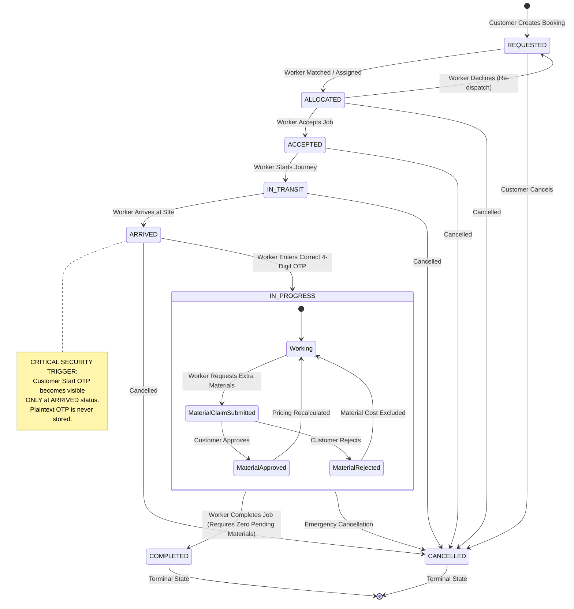

# GigSevak — Booking Lifecycle State Machine Specification

## 1. Lifecycle Diagram

---

## 2. Transition Rules & Security Guards

| From State | To State | Trigger / Endpoint | Authorized Role | Validation Guards & Rules |
|---|---|---|---|---|
| `*` | `REQUESTED` | `POST /api/bookings` | `CUSTOMER` | Pricing engine computes quote; OTP hash stored; plaintext OTP hidden. |
| `REQUESTED` | `ALLOCATED` | System Dispatch | System | Worker matched based on location, tier, and availability. |
| `ALLOCATED` | `ACCEPTED` | `POST /api/bookings/:id/accept` | Assigned `WORKER` | Booking must be in `REQUESTED` or `ALLOCATED` state. Worker marked `ON_JOB`. |
| `ALLOCATED` | `REQUESTED` | `POST /api/bookings/:id/decline`| Assigned `WORKER` | Logs decline reason in dispatchLog; re-opens booking for allocation. |
| `ACCEPTED` | `IN_TRANSIT`| `POST /api/bookings/:id/in-transit` | Assigned `WORKER` | Must be in `ACCEPTED` state. |
| `IN_TRANSIT`| `ARRIVED` | `POST /api/bookings/:id/arrived` | Assigned `WORKER` | Must be in `IN_TRANSIT` state. |
| `ARRIVED` | `IN_PROGRESS`| `POST /api/bookings/:id/start-job` | Assigned `WORKER` | Must be in `ARRIVED` state. 4-digit OTP verified via HMAC-SHA256 constant-time check. |
| `IN_PROGRESS`| `COMPLETED` | `POST /api/bookings/:id/complete` | Assigned `WORKER` | Must be in `IN_PROGRESS` state. **All material requests must be resolved (none PENDING_APPROVAL)**. Worker freed to `AVAILABLE`. |
| Any non-terminal | `CANCELLED` | `POST /api/bookings/:id/cancel` | Owner / Worker / Admin | Cannot cancel `COMPLETED` or already `CANCELLED` jobs. Worker freed if was allocated. |

---

## 3. OTP Security Enforcement Rules

1. **Zero Plaintext Storage:** Plaintext OTP is never saved in the database or server logs.
2. **Revelation Timing:** Customer Start OTP is revealed **only** when the booking reaches `ARRIVED`. Before arrival, `startOtp` is strictly `null`.
3. **Worker Isolation:** The worker endpoint **never** reveals the OTP.
4. **Brute Force Defense:** After 5 consecutive invalid OTP attempts, verification is locked for 15 minutes (`HTTP 429 Too Many Requests`).